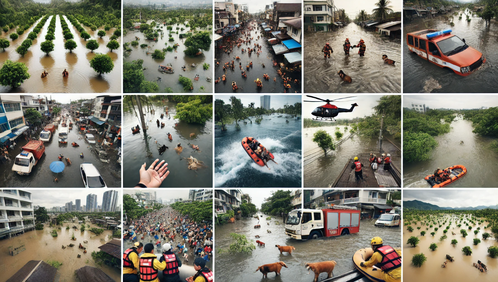
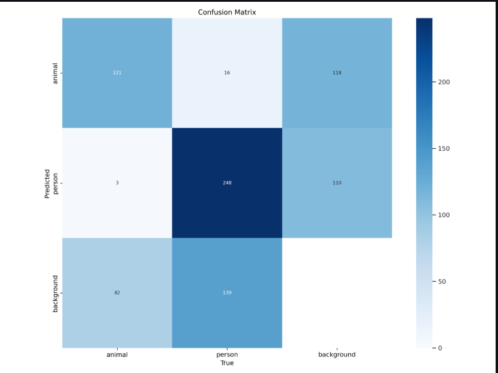
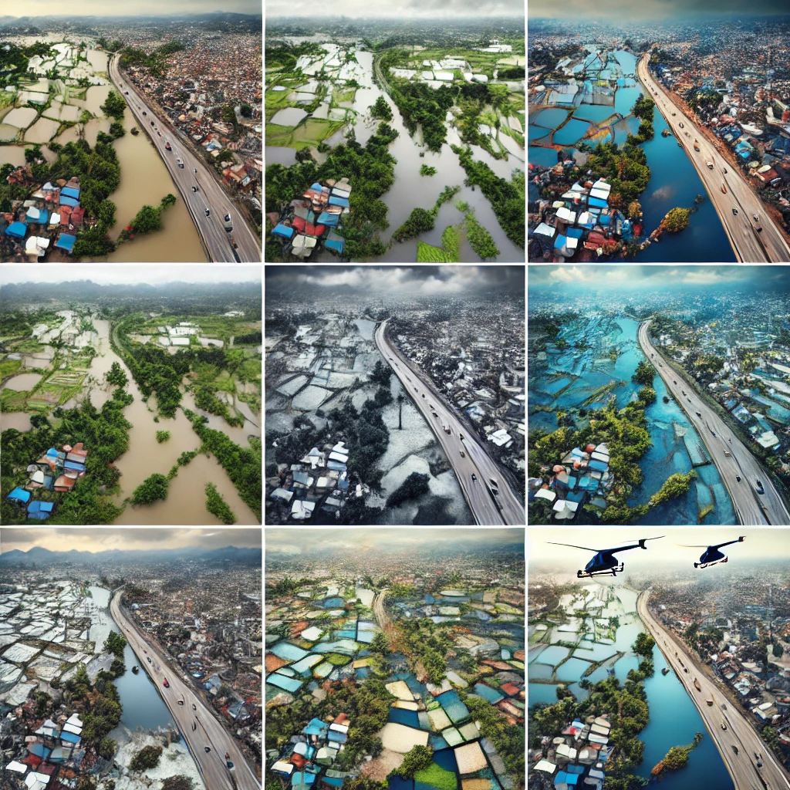

# Apda-Mitra: Disaster Relief and Response Solution

## Overview  
Apda-Mitra is a cutting-edge disaster relief and response system which is designed to enhance the emergency management during natural disasters such as floods and wildfires. This project leverages the **satellite data, **AI-driven analysis, and **drone-based victim detection to improve real-time awareness, optimize the resource distribution and accelerate the disaster response efforts.

## Approach and Key Features  

### 1. **Early Wildfire Detection Using Satellite Imagery**  
- This system employs the advanced satellite data, specifically utilizing **NOAA-20’s VIIRS** (Visible Infrared Imaging Radiometer Suite) sensors, to detect wildfires in their initial stages.  
- By analyzing these satellite feeds, the solution ensures that disaster relief teams receive **timely alerts** and enabling them to take preventive action before the situation escalates.  

### 2. **AI-Powered Drone Surveillance for Flood Rescue**  
- In the flood-affected regions, **drones equipped with high-resolution cameras** are deployed for real-time aerial surveillance.  
- Cutting-edge AI models, such as **YOLOv8**, process drone imagery to detect stranded individuals, helping rescue teams prioritize and streamline evacuation efforts.  

### 3. **Flood Mapping and Risk Assessment via AI**  
- AI-driven image processing techniques, including **semantic segmentation**, are applied to satellite data to analyze **flood extent and impact**.  
- These insights assist emergency responders in making **data-driven decisions**, ensuring efficient deployment of relief resources.  

## Impact and Goals  

- **Faster Disaster Response** → Reduces information lag and provides early warnings to disaster management teams.  
- **Improved Resource Allocation** → AI-driven insights optimize the distribution of food, medical aid, and rescue personnel.  
- **Enhanced Situational Awareness** → Real-time monitoring via satellite and drone imagery ensures a comprehensive understanding of disaster-affected regions.  

By integrating **AI, satellite technology, and drone capabilities**, Apda-Mitra is revolutionizing disaster response strategies, making relief operations more **effective and life-saving**.  

# Victim Detection

#Flood Segmenation

## Getting Started
To use the disaster relief and response solution, follow these steps:

# Use deployed app to check Flood Victim Detection model: https://sahayta.streamlit.app/
UI:

Results:

# Run it in your local machine:
1. Clone the repository to your local machine: `git clone https://github.com/your-username/disaster-relief-solution.git`
2. Install the necessary dependencies and libraries as specified in the documentation.
3. Install requirements for streamlit app
`pip install -r requirements.txt`
4. Set up the environment and configure the solution parameters according to your requirements.
5. Get Your ROBOFLOW_API_KEY from https://universe.roboflow.com/
6. To Check results for Victim Detection in Floods
` streamlit run app.py`
7. To check Results for Flood Detection and Segmentation and Wildfire detection, Run the provided scripts and modules to execute the solution components, analyze data, and generate insights.
8. Output images from Flood Segmentation model training is saved in `./Flood_mapping` 

# Youtube Demo

## License
This project is licensed under the [MIT License](LICENSE).

## Acknowledgments
We would like to acknowledge the contributions of the open-source community and the support of our partners and collaborators in developing and testing this disaster relief and response solution. Thank you for your support!
